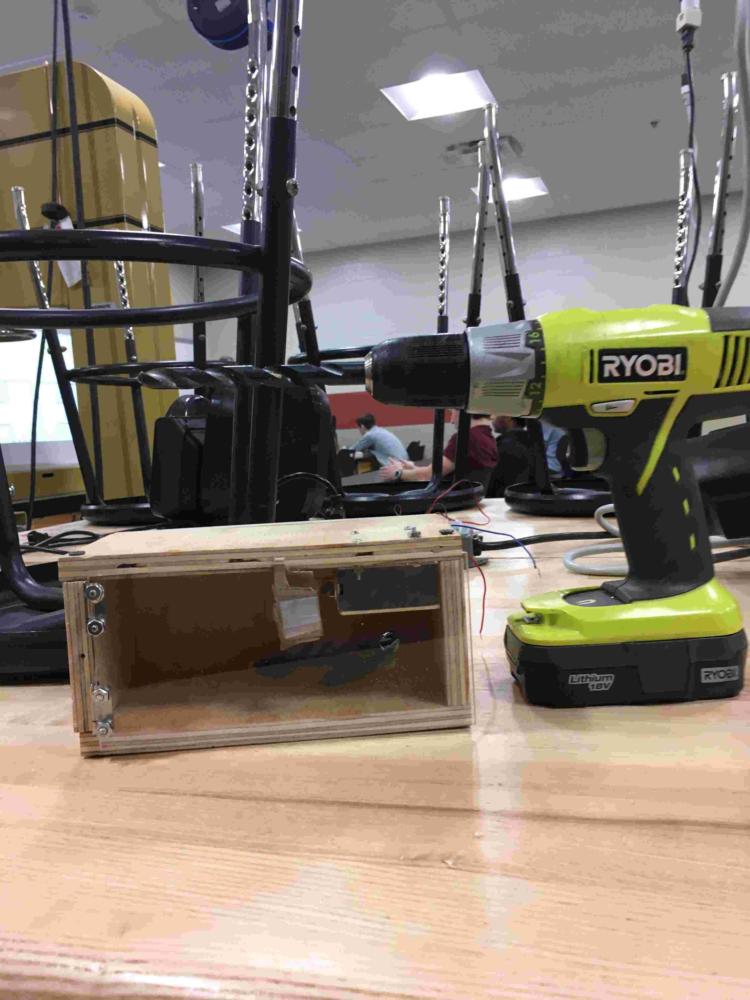
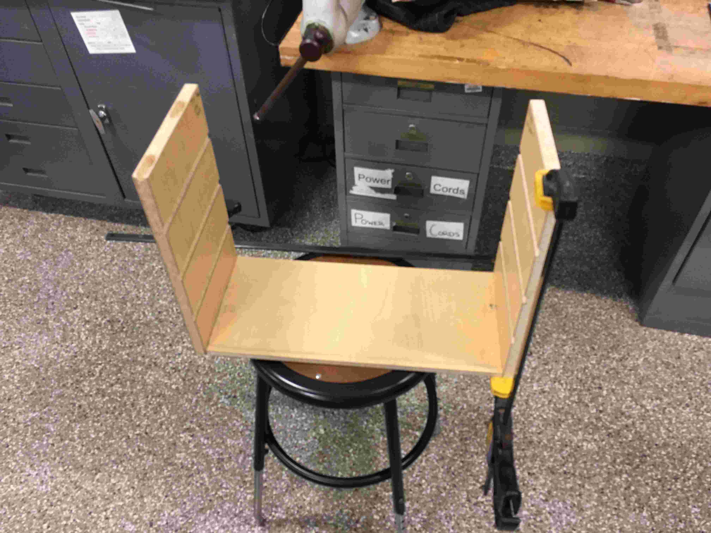
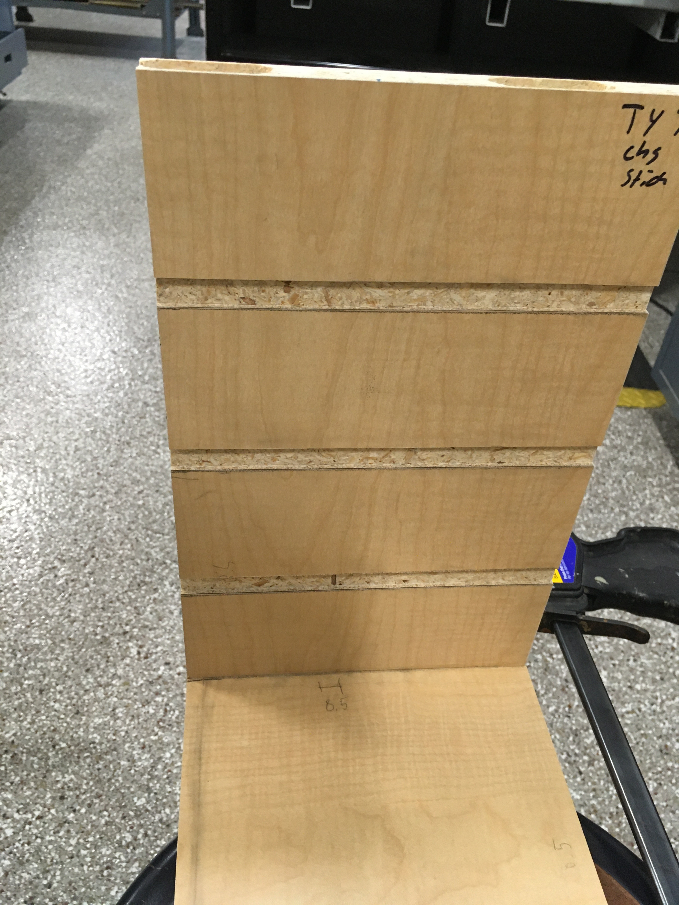
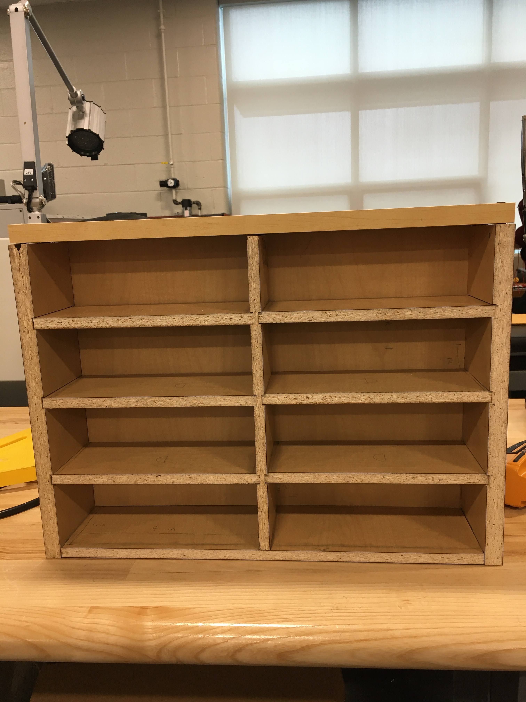
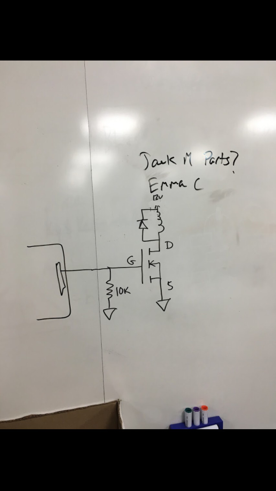
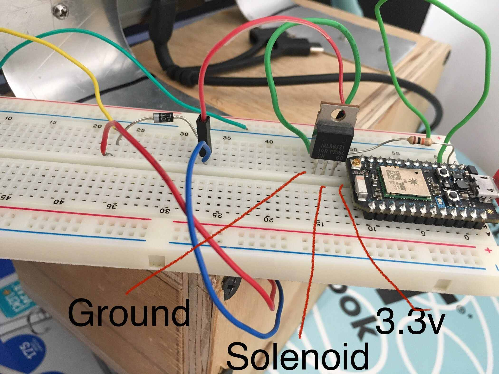
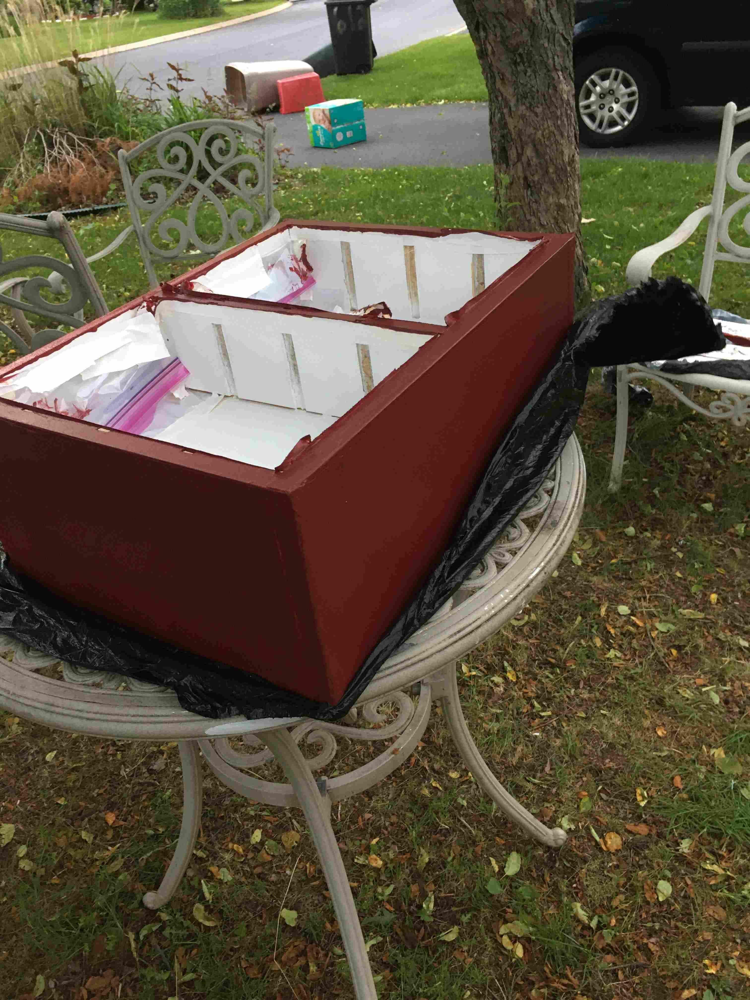
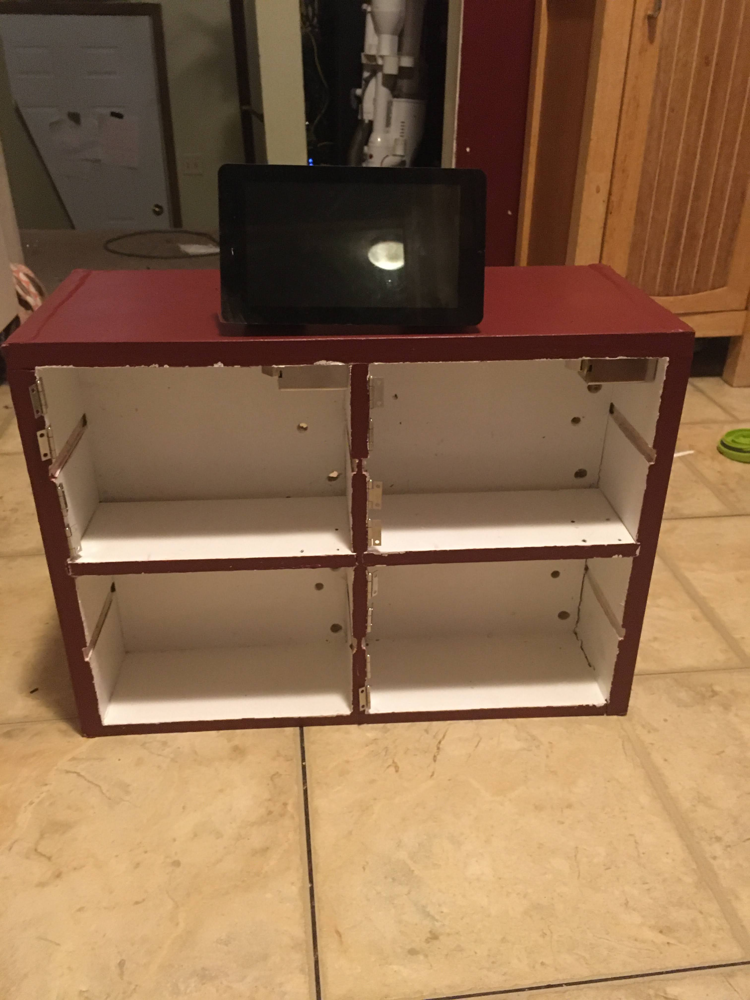
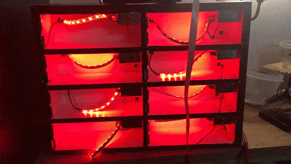
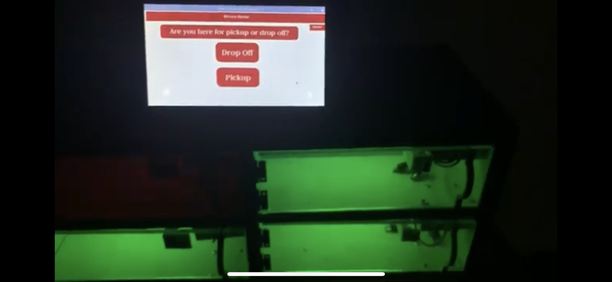

# Charging Station Project

The charging station project is an idea I came up with in late 2019. After winning a $1700 grant, I designed and built the project over a year. The charging station has eight individual cells enclosed by plexiglass doors. The doors are locked and unlocked by solenoids controlled by a Raspberry Pi computer. The computer also controls the touchscreen user interface that prompts users to select a door and enter a pin. Additionally, the computer controls the LED lights, which are pulsing red when a cell is occupied and static green when a cell is open to use.

## Video

<YouTube videoId="LPlF9MMSO6k" title="Charging Station" />

## Gallery

### January 14, 2020

#### Cell is prototyped to see how it will fit around an average cellphone.

### February 25, 2020

### Cell size is adjusted and main body construction starts.

### February 25, 2020

#### Main body with slots

### February 25, 2020

#### Cell dividers are cut out

### March 3, 2020

#### Main body is assembled with cell dividers.

### April 1, 2020

#### Schematic for MOSFET-solenoid circuit is drawn up

### April 2, 2020

#### Testing solenoid-MOSFET circuit with a web controlled microcontroller.

### April 5, 2020

#### Testing circuit with a Raspberry Pi and touchscreen on the prototype cell.

<YouTube videoId="rasbeery_pi_test" title="Raspberry Pi Test" />

### March 29, 2020

#### Body Painted

### June 4, 2020

#### Touchscreen attached to body

### July 1, 2020

#### LED lights and solenoids installed. LED lights are also tested.

### July 4, 2020

#### Playing around with some other themes the LEDs could be programmed to do.

### October 29, 2020

#### All circuits soldered and GUI is completed.

