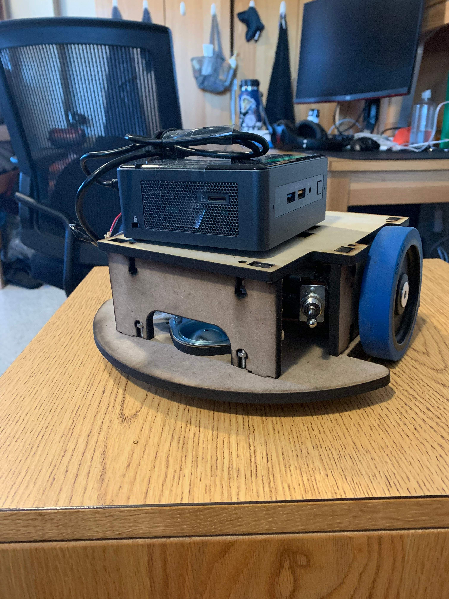

# Autonomous Robot

During January 2021 I build a robot for MIT's Mobile autonomous robotics competition. The goal of the competition was for the robot to autonomously collect wooden balls on the field, sort them (red balls should be kept inside the robot), and launch the green balls to the other side of the field (picture of the field below). My roles on the team include designing a ball elevator mechanism, a sorting mechanism, and the autonomous drive code.

