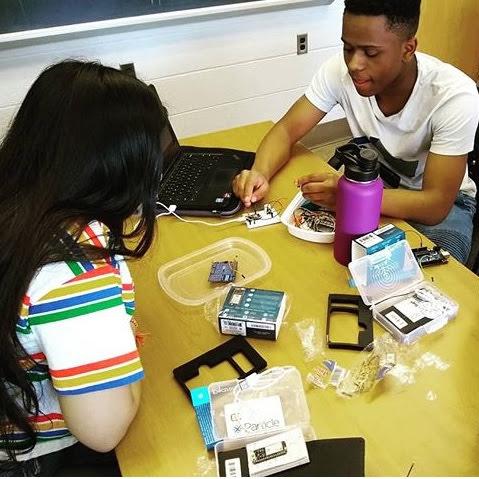
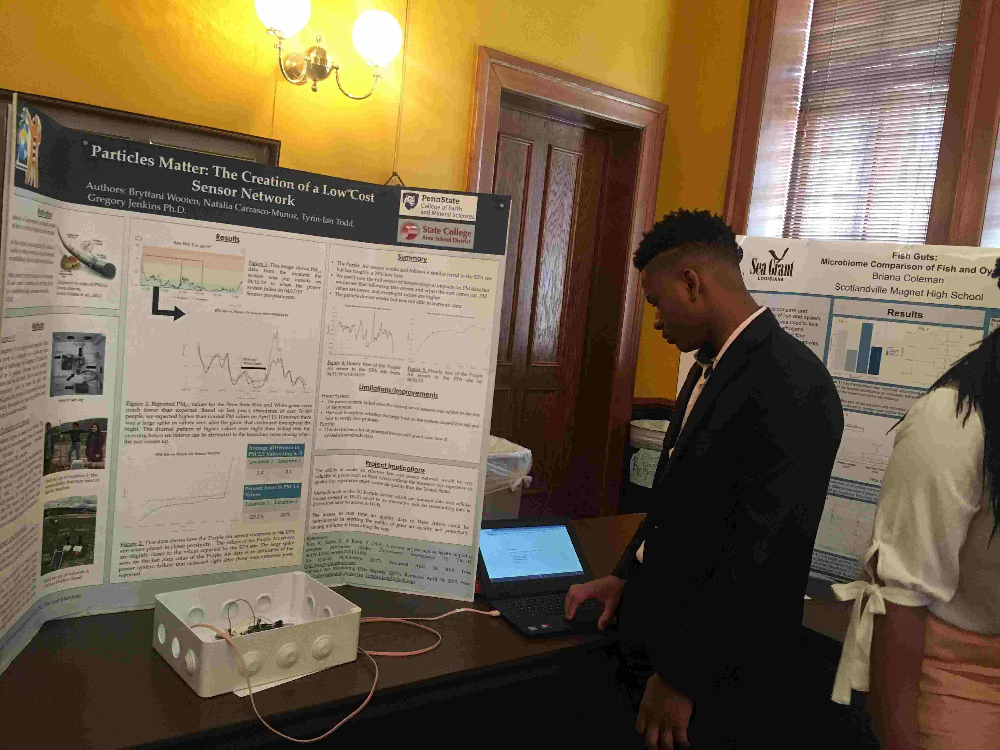

# Particles Matter

Particles Matter was a research project I worked on at Penn State University. The project's objective was to address the fact that even though many West African countries have problems with air pollution, there isn't much data on the particulate matter in the air. Our project goal was to make a low-cost internet-connected sensor that could be later implemented into a network of sensors across the continent of Africa. To start, I designed and programmed internet-connected particulate matter sensors that ran off of solar power. The sensors were tested against data from the EPA and were highly accurate. Additionally, the unit cost of the sensors was only 70 dollars which is low compared to the 100,000 dollar sensors used by the EPA.

