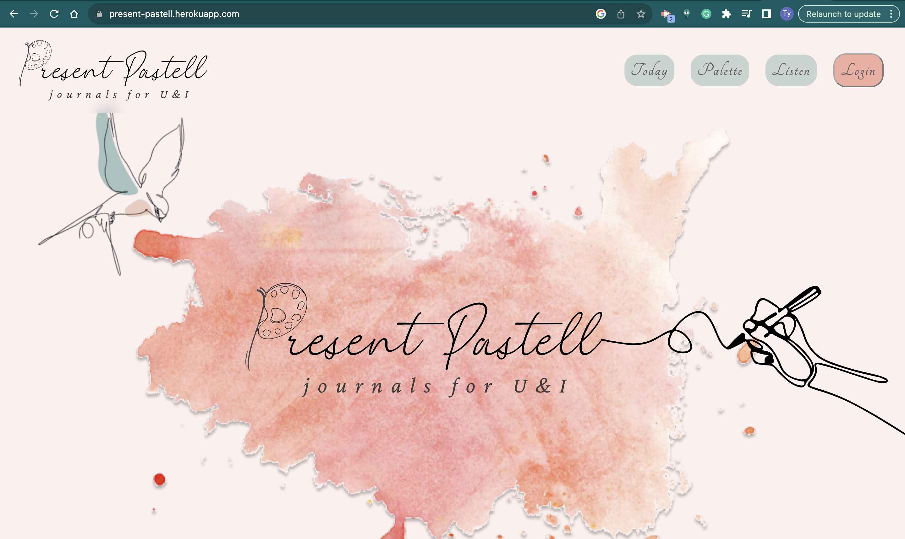
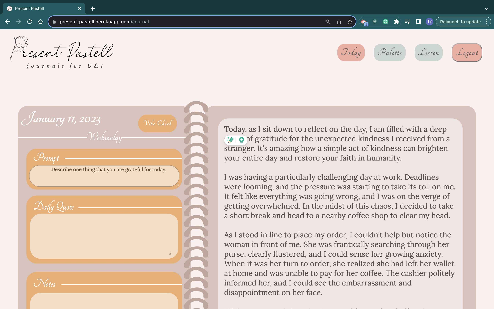
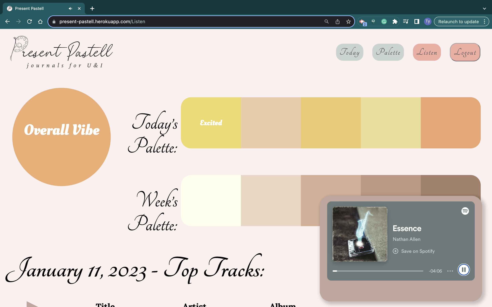
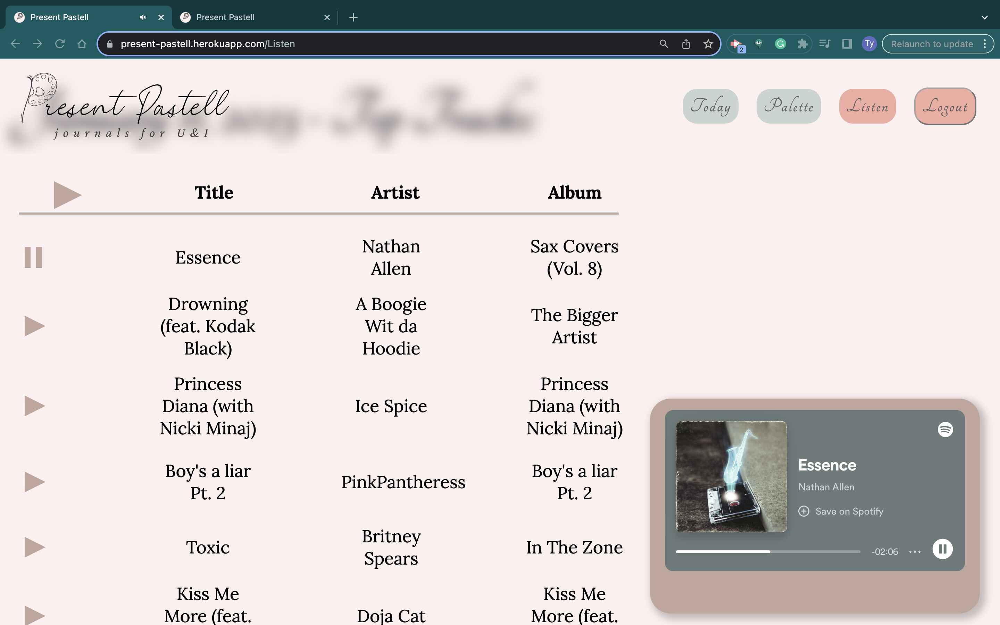
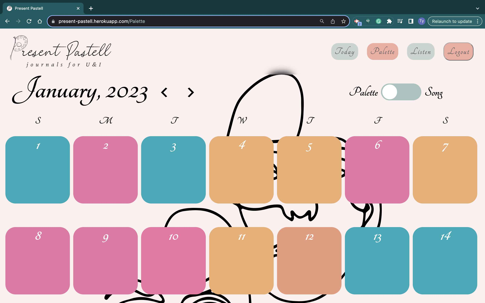
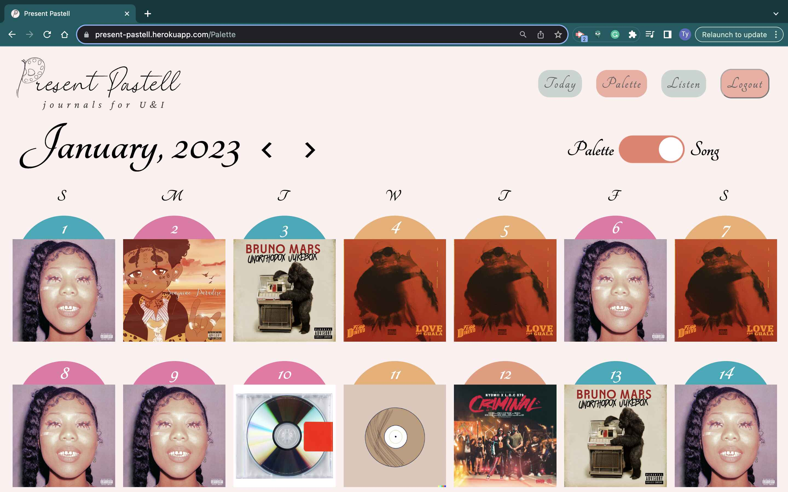
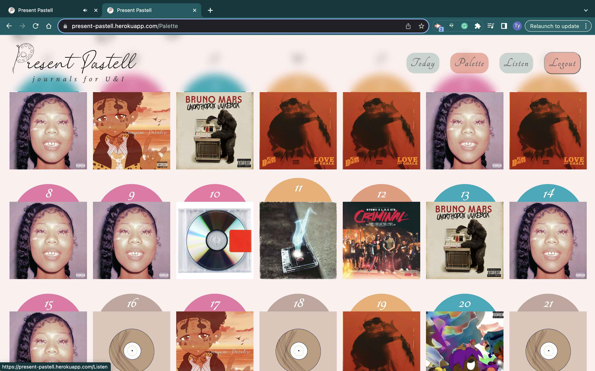

<YouTube videoId="5_1bPEkWdbg" title="Present Pastell" />

Present Pastell is a website I made for the MIT WebLab 2023 competition course. Present Pastell is a website where users can write journal entries. The website was a semi-finalist in the competition and won the best backend feature. I played a full stack role as part of the team of 3. I programmed the frontend for several pages, I also built the entire backend.

## Home Page

These journal entries are then processed using OpenAI's API which will extract the mood from the text. This mood is what the website uses to assign each entry a color.

##

The website also has a feature that goes through a user's recommended songs on Spotify and picks out the songs that match the mood of the entry to create a daily playlist.

## Listen Page

Users can see their past colors, playlists, and entries through the palette page.

## Palette Page

