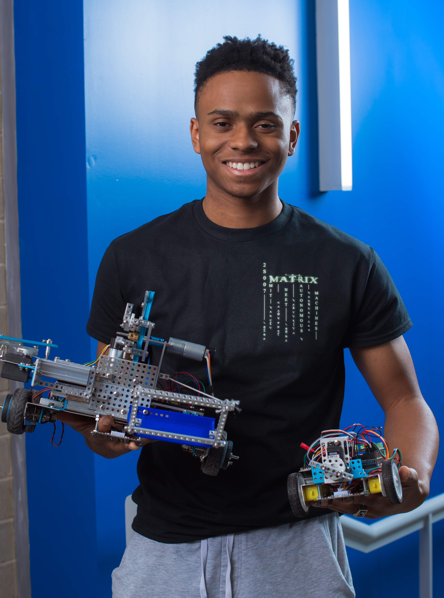
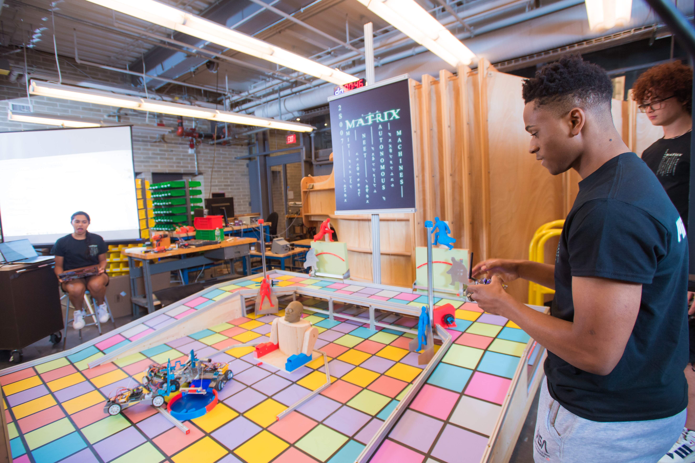
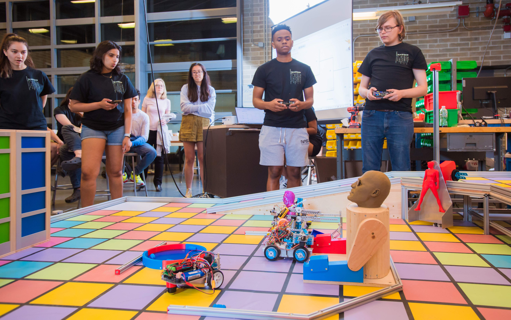
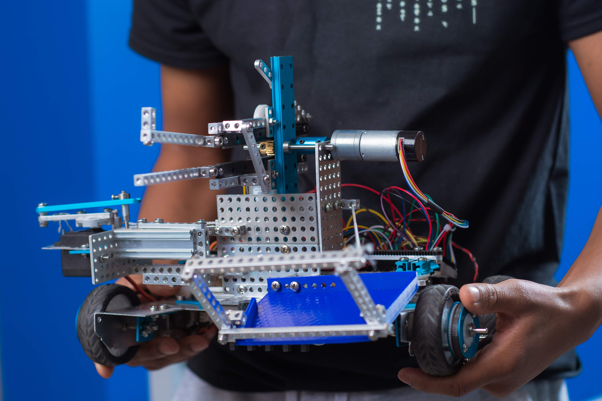
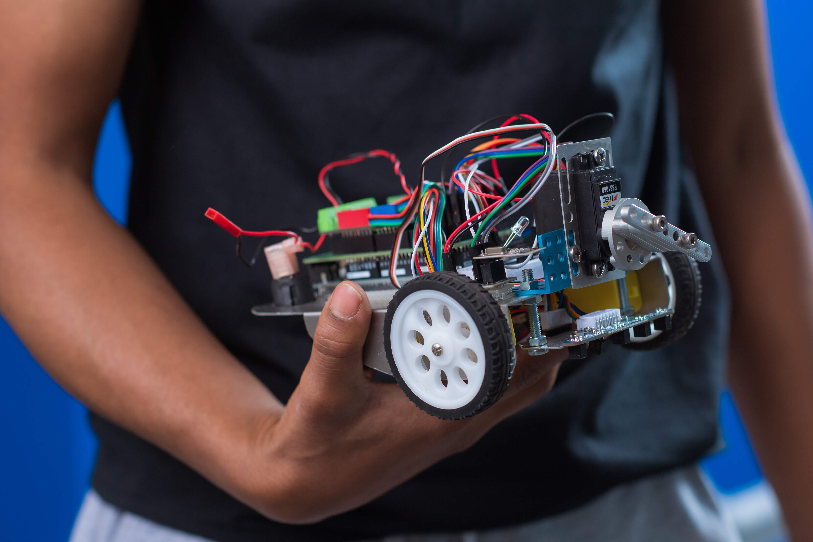

# Semi-Autonomous Robot

During the fall 2023 semester I did a class called 2.S007. During this semester long class I designed, fabricated, and programmed a semi-autonomous robot for a class wide competition where robots compete to complete challenges on an obstacle course. Each year the competition has a different theme and this year the theme was the matrix. Staying true to the theme I named my bigger robot Megabyter (like the megabytes of data that run the matrix) and I named my smaller robot Keanu (after the famous actor that plays the protagonist in the movie). I designed Megabyter and Keanu to work in-sync and complete every challenge on the course, additionally, I prioritized the hardest challenges that some other robots weren't able to do. This strategy paid off as I placed 3rd in the competition, losing only two matches.

## My Robot Autonomously completing a challenge

{/*  */}

## My robot competing

{/*  */}

## Me with my two robots

## Obstacle Course

## Megabyter

## Keanu

