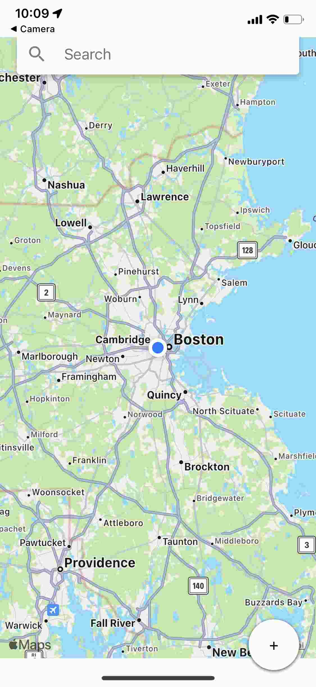
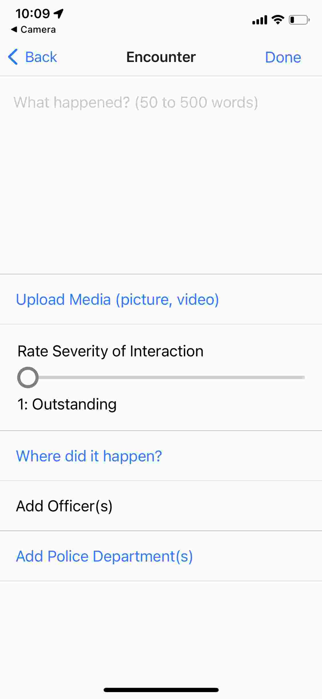
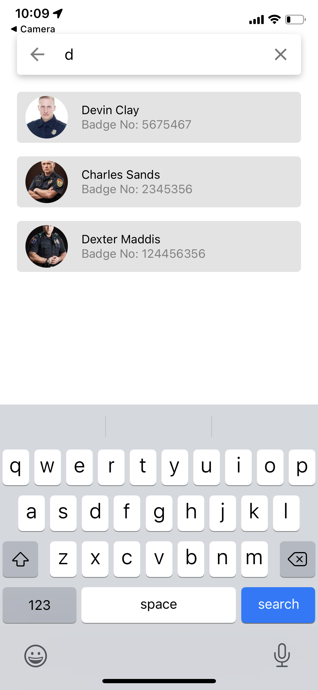
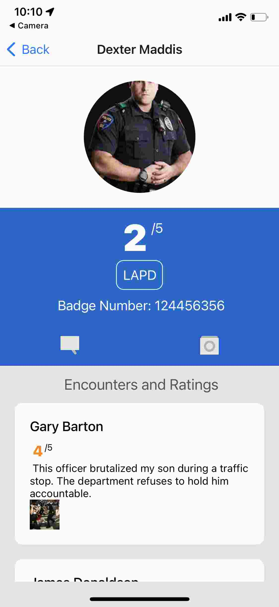
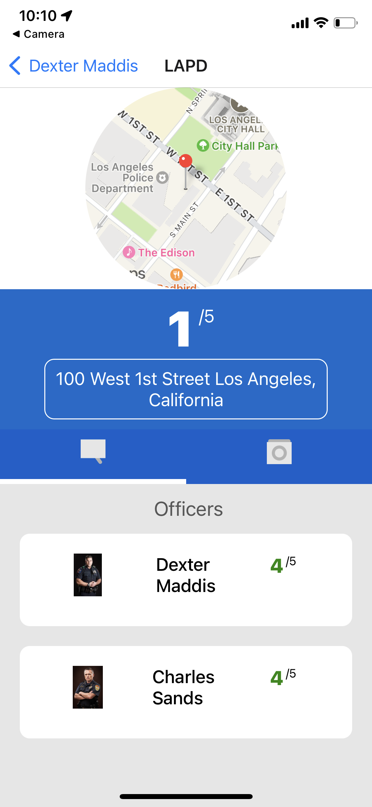
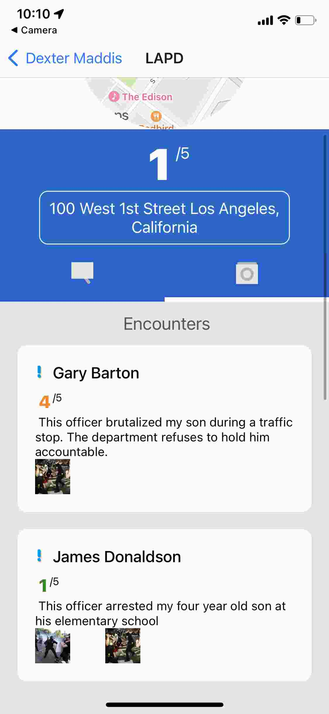
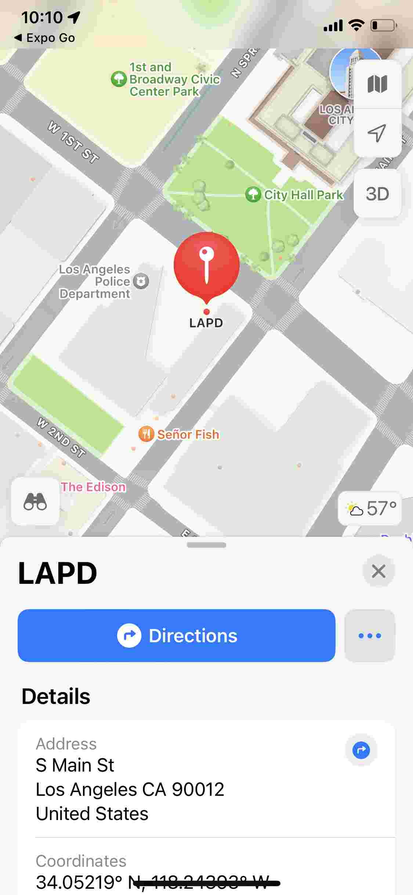

# RateMyProtector

RateMyProtector is an app I started at the HackMIT hackathon and am continuing to develop. The app seeks to uplift communities affected by police brutality by allowing users to report encounters with police officers. The app then compiles this data to give each officer, department, and state a rating from 1 to 5. RateMyProtector was one of 10 finalists out of 147 projects at the HackMIT Hackathon.

## Project Gallery

### Map Page

### Report Encounter Page

### Search Bar

### Officer Profile Page

### Department Profile Page (Officers)

### Department Profile Page (Encounters)

### Apple Maps (opened from app)

