During the spring 2024 semester I did a class called 6.4200: Robotics: Science and Systems. In this class I worked with a team of 4 to program a self driving racecar. There were two final challenges for this class. One was to navigate a cource that simulated a city and the other was to race around a track. In preparation for the final challenge I learned about important concepts in robotics such as machine learning, quaternions and linear algebra. My team and I also implemented several computer vision and robotics algorithms such as PID control, Monte Carlo Localization, Bayesian Filters, path planning, SIFT, color segmentation, and homography.

## Final Challenge Video

<YouTube videoId="HUgiWCYJ-NQ" title="Final Challenge" />

# Algoithms I implemented

The following are algorithms I implemented for my team. My favorite one is the augmented A\* path planning algorithm we used for the final challenge.

## RRT and RRT\* Path Planning Algorithm

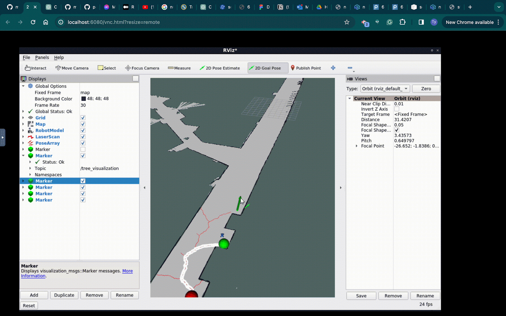

This section only details what I did for this lab you can learn more about the lab [here](https://rss2024-6.github.io/website/labs/6/)

The goal for this algotithm was for the robot to plan a path through a map of the MIT Stata building basement. The perfect path planner would generate and optimal path in the shortest amount of time.

Sample based algorithms sample the continuous space of the map to build a path instead of breaking the map up into discrete parts and performing a search algorithm. This has the benefit of time-efficient pathfinding at the cost of optimality. Our implementation of Dijkstra’s was actually a combination of a sampling and search based algorithm, as it sampled the continuous space to build a graph similar to a probabilistic roadmap. In this section, we will look at a pure sampling-based algorithm, the Rapidly Exploring Tree (RRT) algorithm.

### Growing Paths using RRT

The RRT algorithm starts by initializing a tree at the start point. Next the RRT algorithm samples a random point on the map. It then “steers” the tree towards that point. When we steer, we first select the closest point to our sample, this will be the parent node. Then the algorithm adds a new point at a constant distance away from parent point that is in the direction of the sample. In our implementation we call this distance step. The algorithm will for this for n iterations or until the goal point is found. Fig. 1 shows the pseudocode for this algorithm.

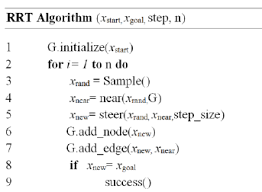
**Fig. 1 RRT algorithm pseudocode. The algorithm takes $x_{start}$ (start position), $x_{goal}$ (goal position), step, and n (number of iterations) and generates a trajectory from $x_{start}$ to $x_{goal}$.**

### Improving with the RRT\* Algorithm

RRT is not guaranteed to find an optimal path. To mitigate this we implemented the RRT* algorithm which creates more optimal paths than RRT, as shown in Fig. 2. RRT* extends the RRT algorithm with a rewire step. In the rewire, we look at all nodes within a search radius from the new node. Then for each node we note the cost from the new node to the root node through it. Lastly we set the parent of the new node to whichever node has the lowest cost. Fig. 3. visualizes this process of rewiring for RRT\*. We repeat this process for n iterations to generate an optimal path as n goes to infinity.

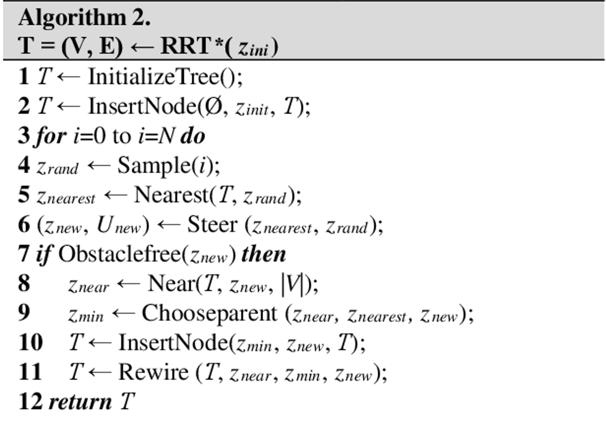
**Fig. 2 RRT\* algorithm pseudocode. Extends the RRT algorithm with the rewire step to generate more optimal paths.**

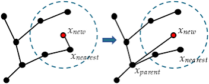
**Fig. 3 Rewire step diagram. As you can see in the photo all nodes within search radius are evaluated. The parent of $x_{new}$ is set to the node with the lowest cost.**

The last optimization we added on top of the RRT* algorithm is a goal sampling rate. We choose a random number between 0 and 1 if this number is below our goal sampling rate we will choose the goal as our sample which will cause the tree to steer towards it. Additionally, instead of running for N iterations the algorithm concludes as soon as the goal is discovered. This helps the RRT* algorithm to converge quicker at the cost of optimality.

This algorithm is more likely to quickly generate an optimal path, however may not produce straight lines or give consistent solutions, as shown in Fig. 4. The RRT\* may even fail to create paths at all. Further comparisons of this algorithm will be discussed in Section II.C.

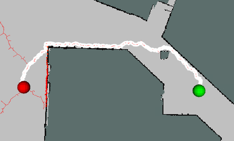
**Fig. 4 Planned path generated by RRT\*. Path is generated from the green start point to the red goal position, as the path is generated between in white. The path avoids the obstacles and walls and reaches its intended goal, however the path tends to be less straight and more inconsistent due to its branching nature. The runtime of this algorithm is quick for shorter paths but occasionally miss optimal solutions.**

### Preventing Crashes with Map Dilation

The algorithm will occasionally generate a path that is too close to the obstacles. To improve safety, we are able to dilate the map as shown in Fig. 5 to improve the safety of our paths. Dilating too little risks not seeing a wall properly, however dilating too much risks generating a wall from two close obstacles and removing an optimal path. A balance of dilating by a factor of 15 gave a suitable new, pre-processed map, which is used for all algorithms.

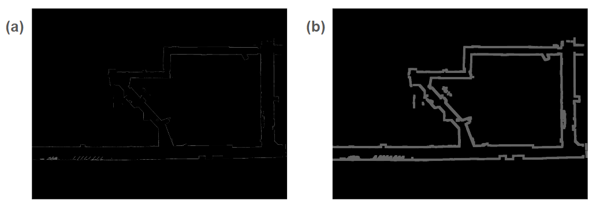
**Fig. 5 (a) The map of obstacles for the MIT Stata Basement, and (b) the improved, preprocessed map of obstacles for the MIT Stata Basement. Obstacle lines are more clear but areas with close obstacles become thinner and more difficult to pass through.**

### Path Planning Results

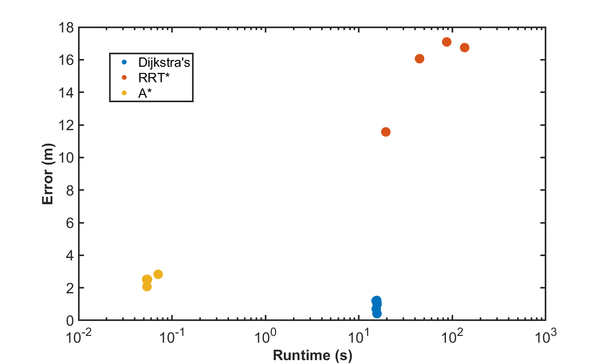
As you can see above RRT and RRT\* actually performed the worse. But they were still fun to implement!

## Augmented A\* Path Planning Algorithm

{/*  */}

This section only details what I did for this lab you can learn more about the lab [here](https://rss2024-6.github.io/website/labs/final/)

The goal of this algorithm was to plan a path through the simulated city course in Stata Basement and the city course brought on some added constraints. The algorithm has to plan a path between the start point, 3 checkpoints, and then back to start. Additionally, the "road" is split into two lanes and the robot must always drive on the right side of the road just like humans. If a checkpoint is in the other lane the robot must do a U-turn to switch lanes and the path planning algorithm must account for all of this.

### Approach

For path planning I used an updated version of a path planning algorithm from a previous lab, A\*. Similar to that lab, the algorithm down-samples the grid into cells and then plans a path from the start point to the destination. However, in this challenge, we had an additional challenge with path planning, the algorithm had to plan a path that respected lane lines. One approach to this problem would be to turn the lane line into an obstacle on the map. Then the robot would never cross lane lines. However, doing so would not allow for the robot to switch lanes when necessary. Such as when the robot needs to turn around. To address this I instead interpreted the map as a directed graph. Where each cell in the map had edge orientations depending on their location in the map. I will talk about each case more in depth below. However, before I discuss how cells are oriented I will talk about how lane orientation is calculated.

### Lane Orientation Calculation

To build the directed graph we must classify the lane orientation of each cell in the graph to one of the 8 cardinal directions as seen below in Fig. 6. In the code the lane line is represented as 10 joined line segments.
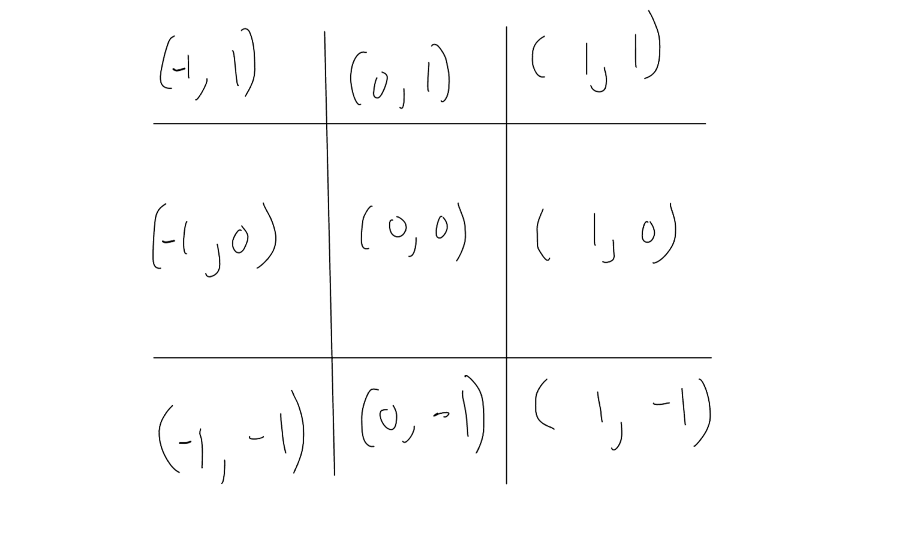
**Fig. 6. The 8 cardinal directions in a grid as they are relative to the origin. These directions are used to form a directed graph which the robot uses for path planning in city driving.**

Since the points are given in order the algorithm is able to generate a series of lane line vectors by taking the difference of the second point and the first point. On the map, this corresponds to a counter-clockwise orientation of the lane lines as seen below in Fig. 7.

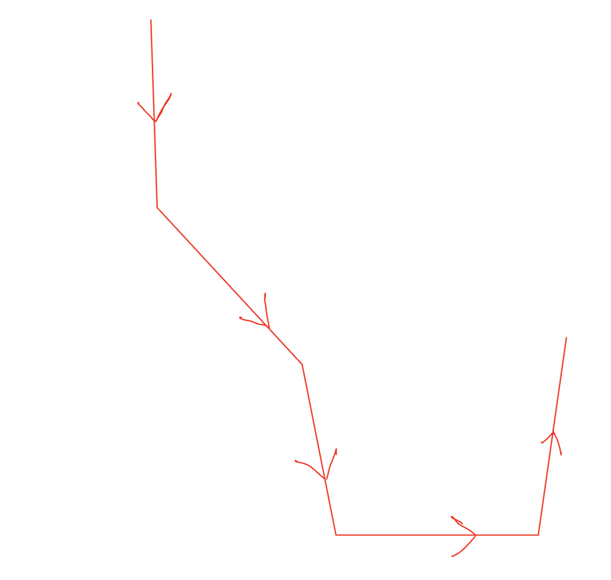
**Fig. 7. Directed line representing the lane line of the city driving track. This line in red is directed into a counter-clockwise orientation.**
To get the lane orientation of a cell the algorithm first finds the closest lane line and its associated vector using the point line formula in (2).

```math
A = y_2-y_1 \\
B = -(x_2 - x_1) \\
C = A \cdot x_1 + B \cdot y_1\\ \tag{2}
\text{Point-Line Distance} = \frac{|A\cdot p_x + B \cdot py - C|}{\sqrt{A^2 + B^2}}
```

This formula calculates the distance from a point to a line where the point is $(p_x, p_y)$ and the line is $(x_1, y_1)$ to $(x_2, y_2)$.

For each cardinal direction the algorithm calculates the dot product between the normalized selected lane vector and the normalized cardinal direction. Whichever cardinal directions normalized dot product is closest to 1 is the cardinal lane orientation. You can see the result of this in Fig. 8.

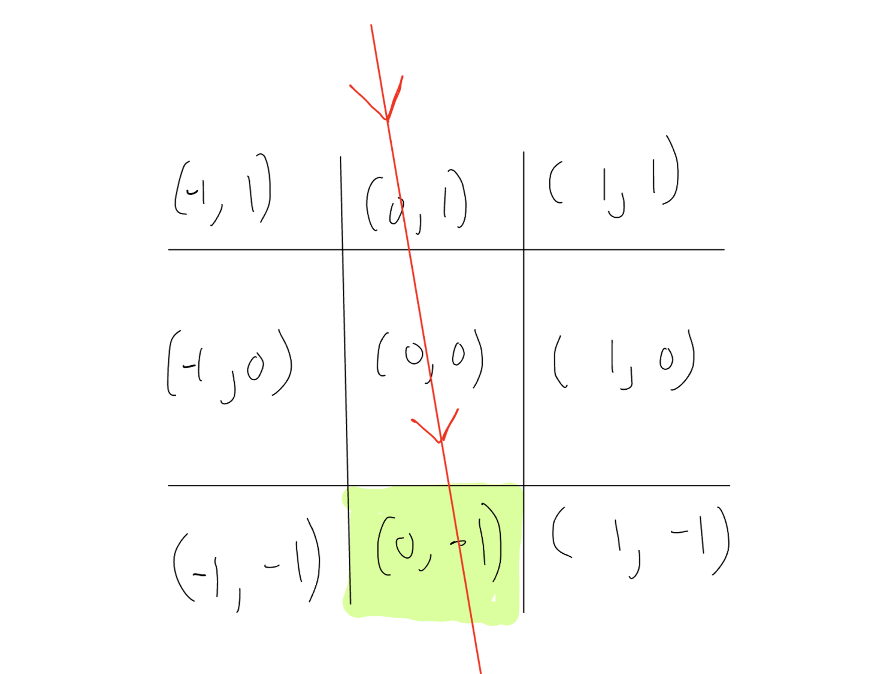
**Fig. 8. Shows how one of the 8 cardinal directions are selected from a lane line. The red line is the lane line and the grid square highlighted in green is the selected cardinal direction which is most parallel to the lane line.**

The algorithm then calculates the cross product of the lane line vector with a vector from the first point in the lane line to the cell. The cross product of these two vectors determines which side of the lane a cell is on. If positive, its on the left side (from the lane vector’s reference frame) as seen below in Fig. 8. For cells on the left side the algorithm multiplies their calculated lane orientation by -1.

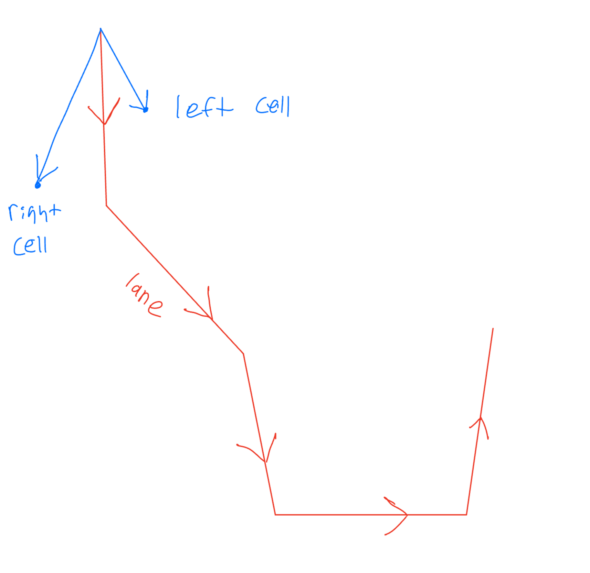
**Fig. 9. Two cells on the map: one on the left side of the lane line and one on the right. For each cell a vector is drawn from the top of the lane line segment to the cell. The cross product of this vector and the lane line vector is calculated to determine which side the cell is on.**

### A\* Graph Edges

After calculating the cardinal lane orientation of a cell, the algorithm can determine which directions to use to find the neighbors for that cell. The cell’s relative cardinal directions are forwards, left-forwards, right-forwards, left, right, left-backwards, right-backwards, and backwards to calculate the global cardinal direction we align forwards to the cardinal lane orientation of a cell. For general cells, the the algorithm uses the forward, left-forward, right-forward, left, and right direction as seen in Fig. 10. If a cell in near a lane line the algorithm uses the only the left and right directions as seen in Fig. 11. This forces the path to move to horizontally when on these cells and prevents it from “straddling” the lane line. There is also a section of the map where the corridor is too narrow and the robot is allowed temporarily ignore lane lines. For this section cells may use any of the 8 cardinal directions.
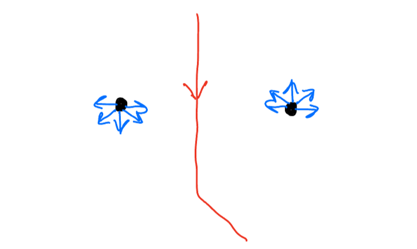
**Fig. 10. Directions assigned to general cells. The middle direction is aligned with the lane orientation with the other four directions being to the left/right of the middle.**

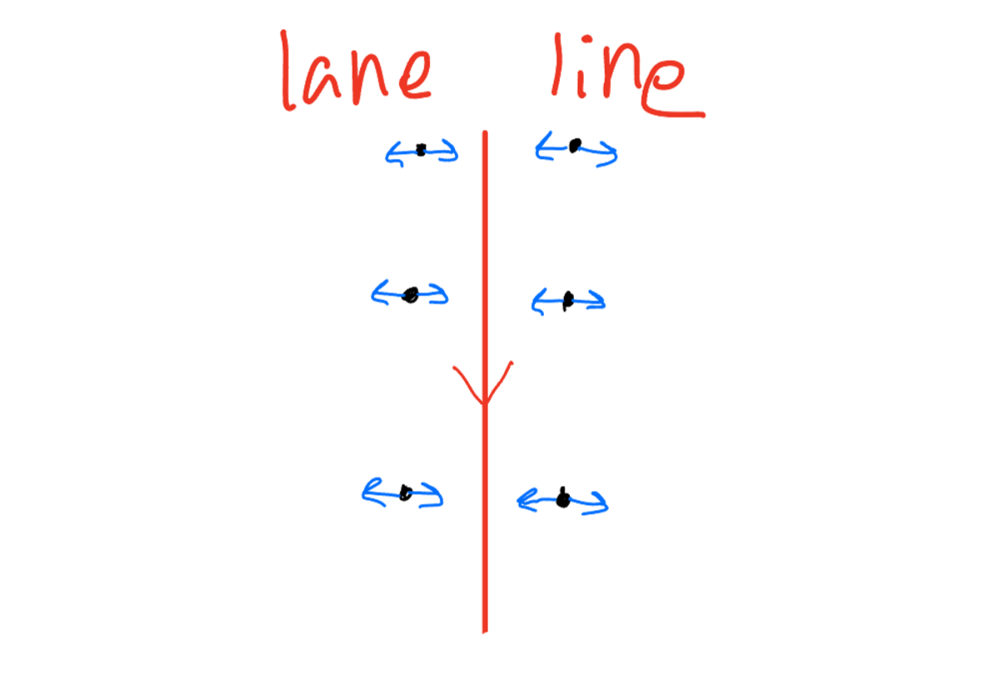
**Fig. 11. Assigned directions for cells near the lane line. Only the horizontal directions are considered restricting the path from traveling forwards when close to the lane line.**

### Corner Edge Case

The setup of edges as outlined above doesn’t account for an edge case around the corner as shown in Fig. 12. In this case the A\* cuts corners by taking advantage of the perpendicular edges of cells that have perpendicular lane orientations. To handle this edge case the algorithm checks that the direction of travel of an edge is not anti-parallel to the the cardinal lane orientation of the neighbor it is traveling to.
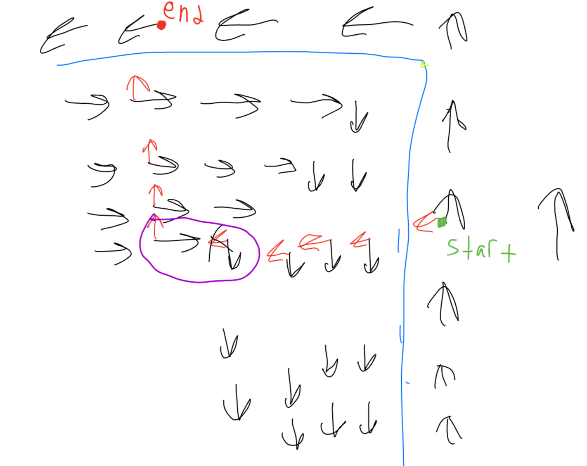
**Fig. 12. Corner edge case. As seen the expected path should go around the corner but instead the algorithm jumps across perpendicular edges to cut the corner. This corner edge case is mitigated by checking that the direction of travel of an edge is not anti-parallel to the the cardinal lane orientation of the neighbor it is traveling to.**

### Runtime

While the calculation of the neighbor directions runs in constant time, the updated algorithm is pretty costly due to the scale of how many cells need their neighbors to be calculated. The added cost doesn’t add too big of a difference to the runtime in simulation. However, it uses 177% of compute on the robot’s hardware and results in some longer paths taking over a minute to generate. To address this we precompute all the edges on the graph in simulation then just load the graph when working on the robot’s hardware.

### Evaluation

Since we know A\* will always generate an optimal path for this lab our evaluation metrics were based on runtime and how well the path followed the rules. We found, on average, our path planner was able to generate a path (on the robot’s hardware) in approximately 45 seconds. We also found that our path itself never produced any lane violations.

## Particles Filter

This section only details what I did for this lab you can learn more about the lab [here](https://rss2024-6.github.io/website/labs/5/)

The particles filter integrates the sensor model and the motion model that my teamates implemented to get a predicted pose. On a high level, it follows a 4 step process to achieve this.

1. Get an initial distribution of particles based on ground ground truth data.
2. Use laser scan and sensor model to update particle distribution
3. Calculate new particles using motion model and predicted odometry
4. Each time particles is updated, publish an average pose

### Step 1: Initialize particles

Initializing the particles is fairly straightforward. The robot always has access to some ground truth pose, therefore we can use a normal distribution centered at the ground truth pose with a variance, $\sigma$, for the initial particle values, as demonstrated by Fig. 13. We decided to use a variance of 0.1 because it generated a satisfactory and wide spread of particles around the robot.

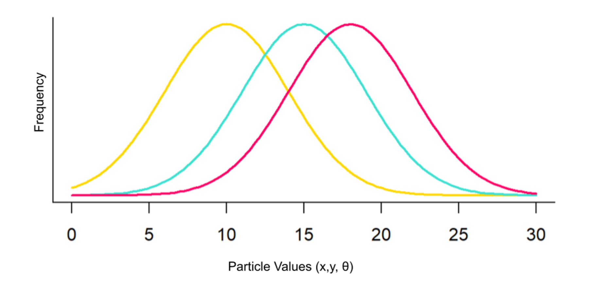
**Fig. 13. Gaussian Distribution shows how different particle values (x,y,theta) are normally distributed by frequency.**

### Step 2: Update particle distribution based on laser scan

The next step involves adjusting the particle distribution based on incoming LiDAR data. Both the particles and the laser scan are processed through the sensor model, which generates a list of probabilities for each particle's accuracy. These probabilities are then used to resample particles, ensuring that particles with higher probabilities are represented more frequently than those with lower probabilities.

### Step 3: Update particle distribution based on odometry

In step 3, the current odometry data is calculated. Then, the motion model, is applied to the current particle distribution and odometry, yielding a new particle distribution for the next timestep. The odometry calculation involves converting continuous-time velocity, $v$, measurements into their displacement counterparts by multiplying them by $dt$, the change in time to find the change in the $x$, $y$, and $\theta$ positions; $dx$, $dy$, and $d\theta$ respectively; as shown in (10).

```math
dx = v_x*dt \tag{10}\\
dy = v_y*dt\\
d\theta = v_{\theta}*dt
```

There were multiple options to get velocity in this equation, such as using the current velocity or the previous. To take both velocities into account, we decided to use the average of the two velocity to calculate odometry for an updated formula, (11).

```math
dx = (v_x-v_{x0})/2*dt\\
dy = (v_y-v_{y0})/2*dt\\
d\theta = (v_{\theta}-v_{\theta0})/2*dt \tag{11}
```

### Step 4: Update pose

Every time the particles are updated an average must be calculated. Unfortunately, this is not trivial as it seems. As described in the lab write up, “an average could pick a very unlikely pose between two modes” [1]. For example if the data were to look like Fig. 14, the algorithm inaccurately predicts our pose at the red triangle which has a low probability distribution and is therefore likely inaccurate. Our model is almost certain the robot is not there.
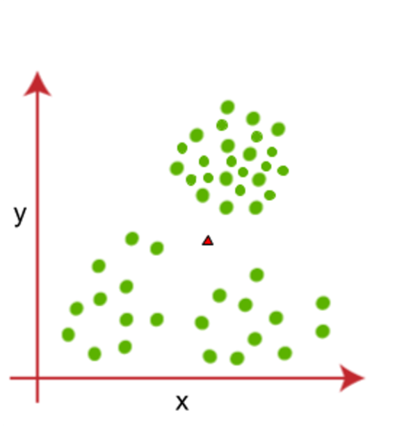
**Fig. 14. Improved predicted position using mode clustering. The dots are now grouped into different colored clusters. The algorithm chooses the cluster with the most particles, in green, and uses the mean of cluster, resulting in an improved prediction of where the robot may be, as there is a high probability distribution at its location.**

Instead a better approach would be to split the data set into “clusters”. The biggest cluster will correspond to an area that our model is the most confident the robot is currently located in. Then we can take the average of this cluster to calculate the pose. As you can see in Fig.5, the predicted position is located in an area where the model has high confidence (The cluster with the most particles).

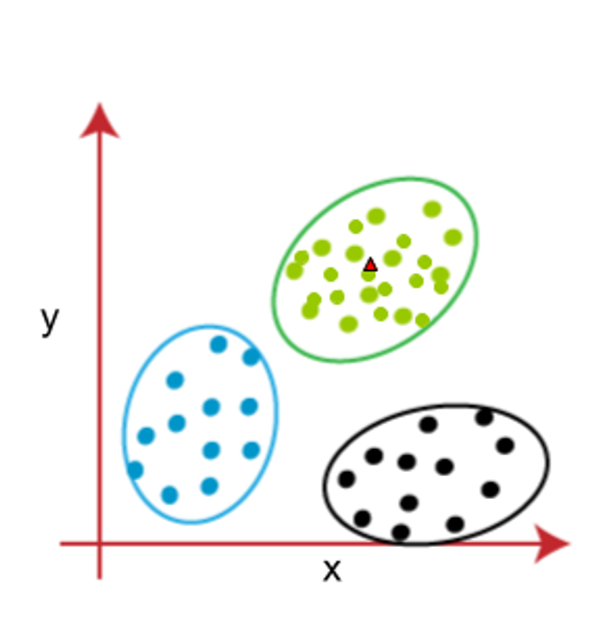
**Fig. 15. Improved predicted position using mode clustering. The dots are now grouped into different colored clusters. The algorithm chooses the cluster with the most particles, in green, and uses the mean of cluster, resulting in an improved prediction of where the robot may be, as there is a high probability distribution at its location.**

This procedure creates a robust particle filter that can accurately estimate the location of the robot on a map, being less susceptible to outliers and errors in the sensor data, and quickly update due to the reduced computation time of the motion and sensor models.

## Traffic Light Detection

Writeup Coming soon...

## Pure Pursuit Controller

The goal of this controller is to navigate to be a certain distance away from the cone while orienting the robot towards the cone. The cone is the orange cylinder in this simulation.
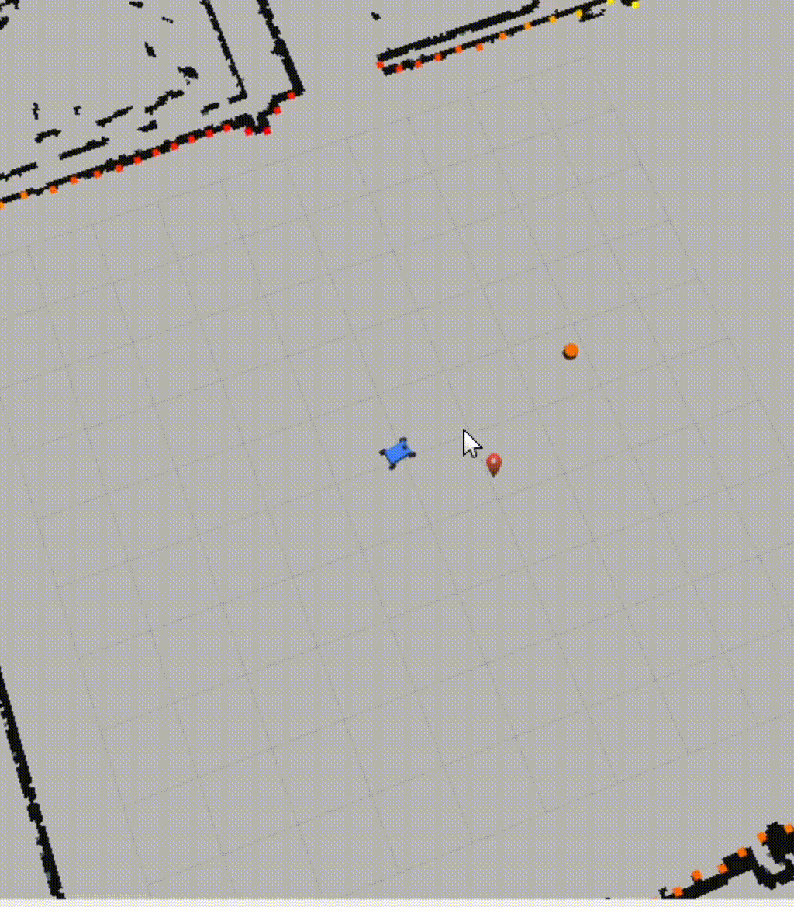

### Math

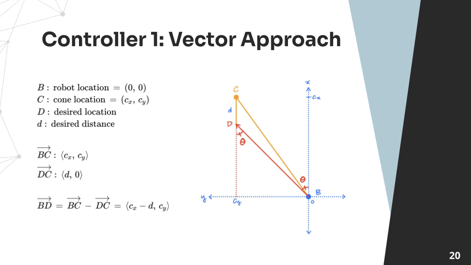

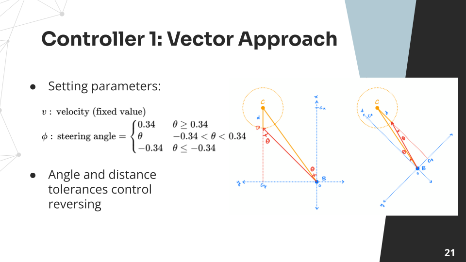
