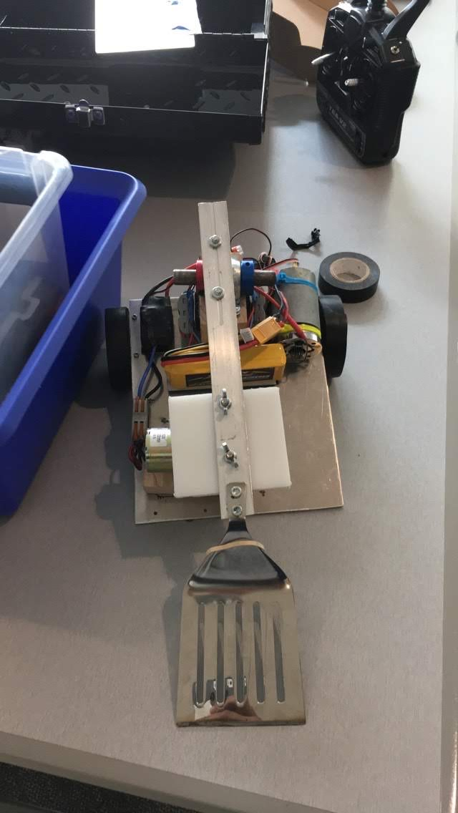
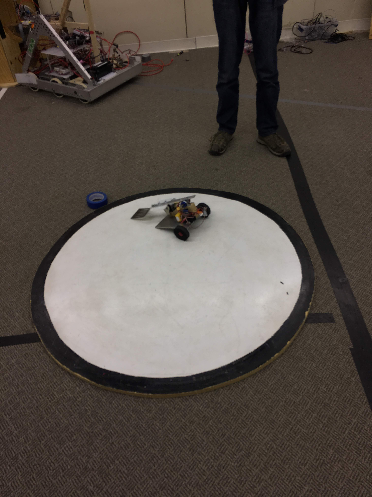

# The Spatula Sumo Bot

The Spatula Bot is a remote-controlled sumo bot I worked on for the Penn State IEEE sumo bots competition. The bot's goal is to push the opposing robot out of the ring. The robot drives the spatula under the opponent and uses a motor to elevate it, causing it to lose balance. Then the bot pushes the opposing bot out of the ring. The spatula bot won every match except for one. My role for the project was cutting and assembling the mechanical pieces.

