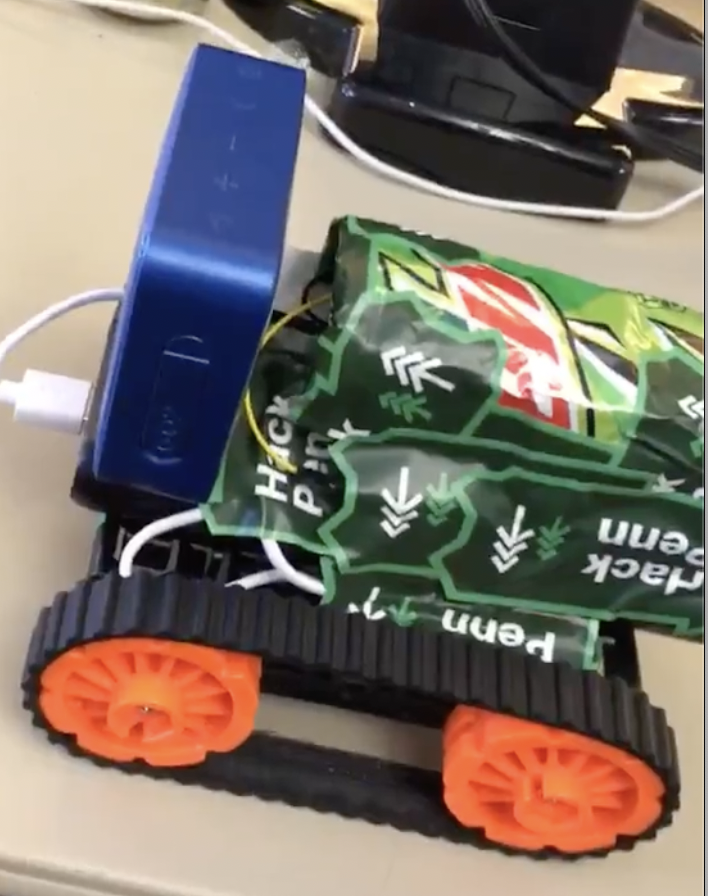
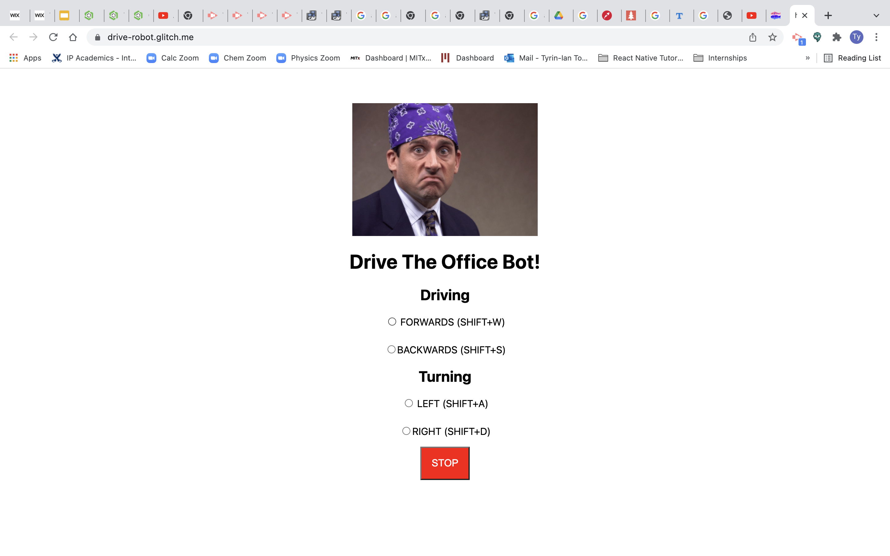

The Office Bot is a mobile web-controlled robot I worked on for the HackPennsylvania's 24 hour Hackathon. The website below sends commands (forward, backward, left, right) to the robot, which it follows. The robot can also talk to people using quotes from the show The Office. The robot won the best hardware award at the HackPennsylvania competition.

## Remote control page

## Video Demo

<YouTube videoId="_9rsyoW6yUo" title="The Office Bot" />
